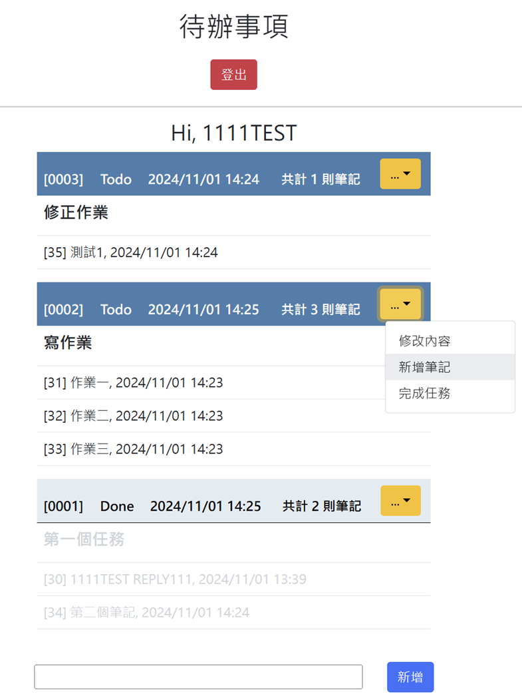
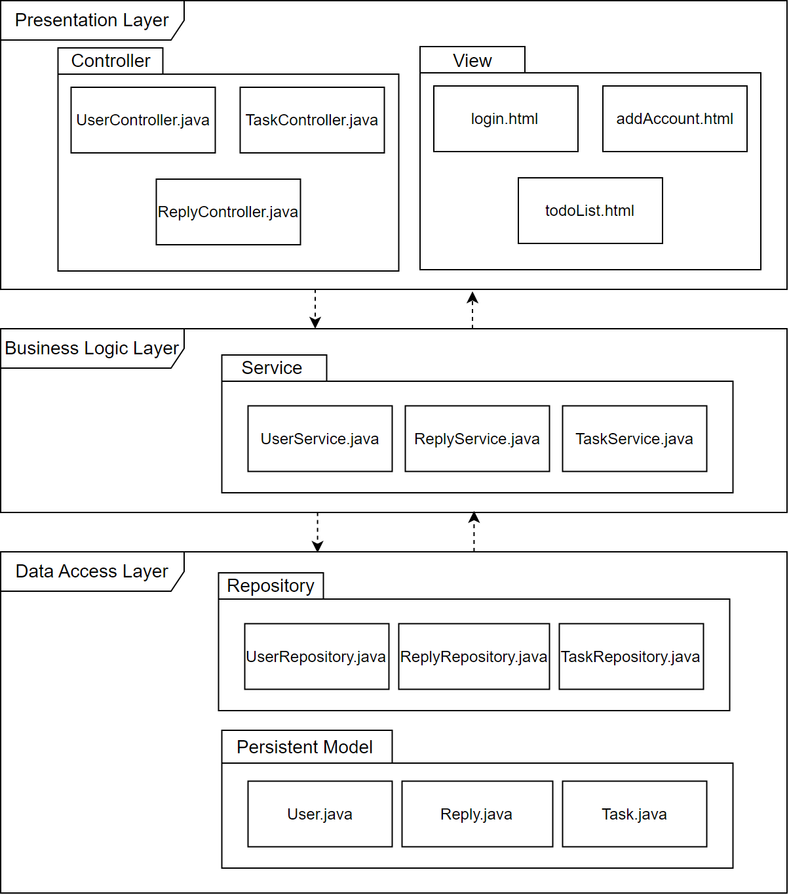
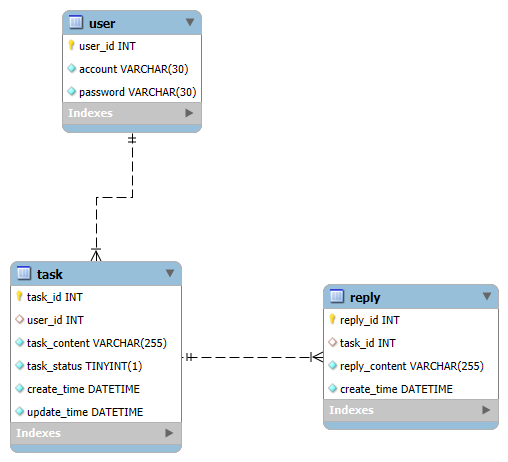

# CSP 實習計劃面試前作業

> 利用 java spring boot 開發一個讓使用者可以建立及紀錄個人待辦事項的簡易網頁工具

## 專案畫面

 

## 功能

- 訪客必須先**建立帳戶**才能成為此網頁的使用者
- 使用者 (User) 可以**登入及登出個人帳號**，登入後能夠一次**瀏覽全部的個人待辦事項 (Task) 及筆記 (Reply)**，也可以**建立多筆新的待辦事項**
- 每個待辦事項之下可以**建立多個筆記**，待辦事項的**狀態可以更改（關閉、重新開啟）**
  - 如果為關閉的待辦事項就無法進行更動
  - 可以更新未關閉的待辦事項內容，在未關閉的待辦事項下新增多筆筆記

## 專案架構

> 採用 Controller-Service-Repository 架構進行開發

 
 

### Controller

- 負責接收從view傳來的HTTP請求，並交給相應的Service來執行業務邏輯

### Service

- 負責處理業務邏輯，如果有需要從資料庫存取或是修改資料，會呼叫 Repository 的方法來處理

### Repository

- 負責和資料庫互動
- 當 Service 向 Repository 發送數據存取請求時，Repository 會進行增刪改查操作

### Model

- 負責定義資料的結構與屬性
- 當 Repository 從資料庫中存取資料時，它會將資料包成model的物件後返回給 Service。處理完畢後，再交由controller將結果呈現給用戶

## ERD

  

## 相關技術

- 前端使用 Thymeleaf 和 Bootstrap 來進行頁面渲染和設計
- 後端使用 Java Spring Boot 框架，MySQL做為資料庫

### Requirements

- Java 1.8
- MySQL

## 執行專案

1. `git clone`
2. 執行`src/DB/base.sql`建立資料庫
3. 修改及完成`application.properties`當中連接資料庫所需的設定，將檔名`.template`刪除
4. `mvn spring-boot:run`執行專案

### Endpoints

- 登入帳號：`http://localhost:8080/csp/login`
- 建立帳號：`http://localhost:8080/csp/createAccount`
- 查看所有待辦清單：`http://localhost:8080/csp/todoList`

## 備註

- `original`檔案夾為作業的原始碼
- 建立`logs`資料夾用來存放日誌